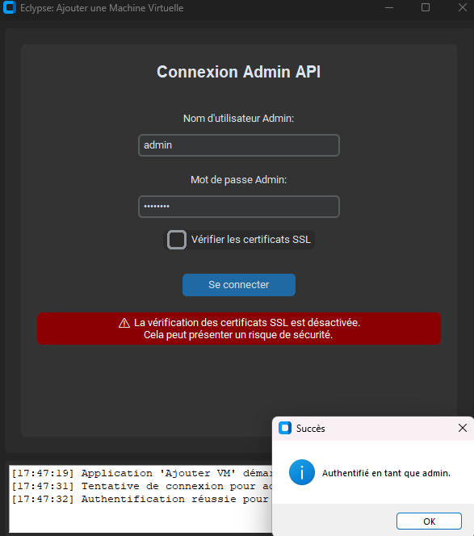
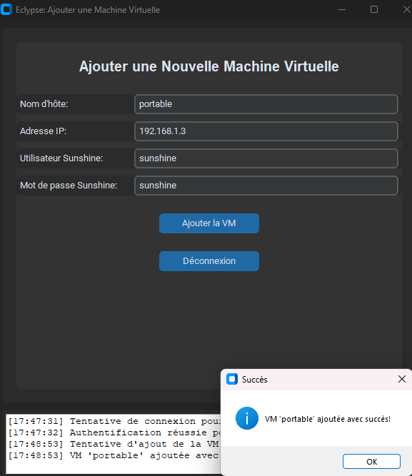
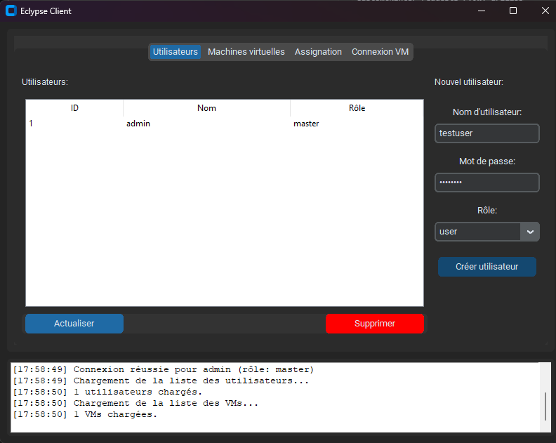
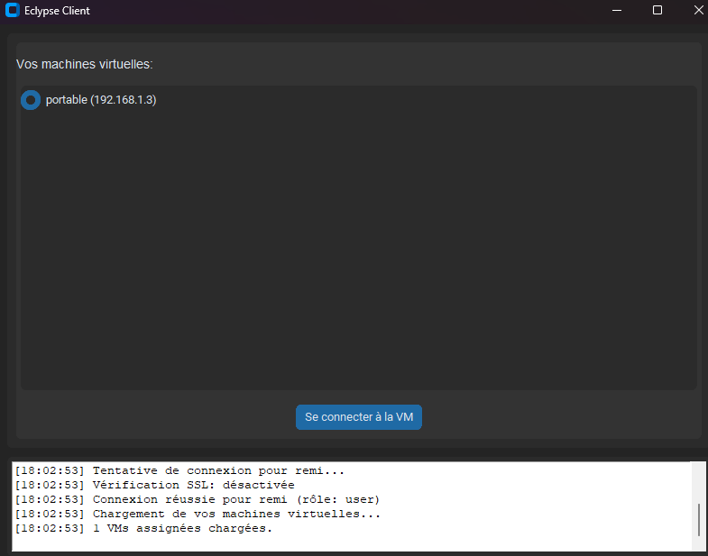

<div align="center">
  
  
</div>

# Eclypse - The Sunshine Manager

**Centralized management system for Sunshine remote access infrastructure**

*This project is based on [Sunshine](https://github.com/LizardByte/Sunshine) and [Moonlight](https://github.com/moonlight-stream/moonlight-qt) technologies*

---

## Do you need to manage computers / VMs with Sunshine utilized for gaining remote access to computers?

Here is the solution: **Eclypse_The_Sunshine_Manager**

Eclypse is a centralized management system designed to simplify the management of multiple Sunshine servers. It handle secure client-server pairing without exposing sunshine credentials to the end users.

### Key Features:
- **Centralized VM Management**: Register and manage multiple Sunshine machines from a single interface
- **User Access Control**: Role-based system (master, admin, user) with secure VM assignments
- **Secure Pairing**: Handles Moonlight client authentication with Sunshine servers without credential exposure
- **Web API**: RESTful API for integration with existing management tools
- **Docker Deployment**: Easy deployment with Docker Compose

--- 

## Prerequisites

- **Operating System**: Linux distribution (Debian/Ubuntu recommended)
- **Docker** : Docker et Docker Compose installed
- **Git**: For cloning the repository
- **Network**: Port 443 (HTTPS) available for the web interface

---

## Quick Deployment

### 1. Clone the Repository
```bash
git clone https://github.com/themimi974/Eclypse_The-Sunshine-Manager.git
cd Eclypse_The-Sunshine-Manager
```

### 2. Launch with Docker Compose
```bash
docker-compose up -d
```


That's it! The application will be available at `https://your-server-ip`

---

## Usage

### 1. Register Sunshine Servers
- Use client\add_vm_gui.py
(Python with customtkinter requests PyJWT urllib3 is required)

- Log in as an admin/master user


- Provide hostname, IP address, and Sunshine credentials


### 2. Create User Accounts
- Use client\eclypse.py or eclypse.exe
- Sign in as a default admin


- Create User account in user tab



### 3. Assign VMs to Users
- Users will only see VMs they're authorized to access

### 4. Client Pairing
- Use client\eclypse.py or eclypse.exe
- Sign in as a user (without admin privileges)


- Connect to the VM



---

## Security Considerations

- **Change Default Passwords**: Immediately change the default admin password after first login
- **Network Security**: Restrict access to the management interface using firewall rules
- **SSL Certificates**: **Do not use default** SSL certificates for production deployments
- **Regular Updates**: Keep the application and dependencies updated

---

## What's next ?

- Full English translation of the project
- Keycloak integration
- Full-fledged deploiement guide on youtube