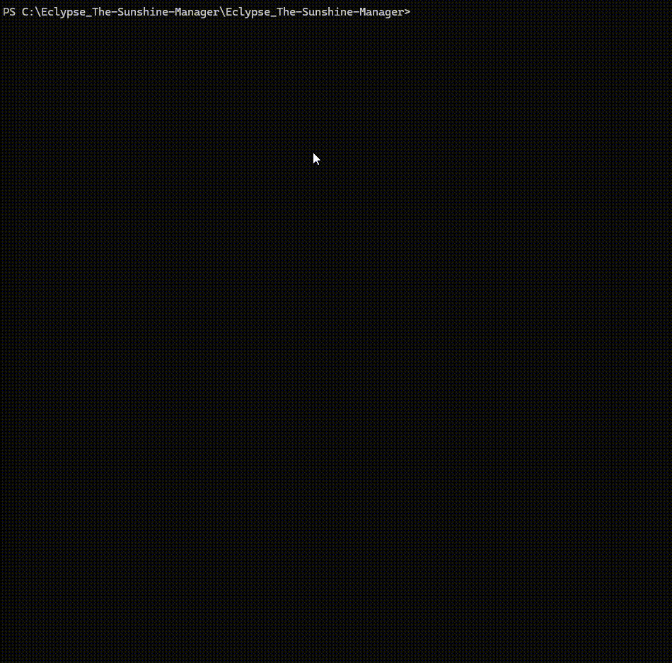

<div align="center">
  
  
</div>

# Eclypse - The Sunshine Manager

**Centralized management system for Sunshine remote access infrastructure**

*This project is based on [Sunshine](https://github.com/LizardByte/Sunshine) and [Moonlight](https://github.com/moonlight-stream/moonlight-qt) technologies*

---

## Do you need to manage computers / VMs with Sunshine utilized for gaining remote access to computers?

Here is the solution: **Eclypse_The_Sunshine_Manager**

Eclypse is a centralized management system designed to simplify the management of multiple Sunshine servers. It handle secure client-server pairing without exposing sunshine credentials to the end users.

---

## Quick Deployment

### 1. Clone the Repository
```bash
git clone https://github.com/themimi974/Eclypse_The-Sunshine-Manager.git
cd Eclypse_The-Sunshine-Manager
```

### 2. Launch with Docker Compose
```bash
docker-compose up -d
```



That's it! The application will be available at `https://your-server-ip`

---

## Usage

### **PLEASE TAKE A LOOK AT THE USAGE DOCUMENTATION LOCATED HERE**

[Introduction Guide](./Introduction.md)

---

## Prerequisites

- **Operating System**: Linux distribution (Debian/Ubuntu recommended)
- **Docker** : Docker et Docker Compose installed
- **Git**: For cloning the repository
- **Network**: Port 443 (HTTPS) available for the web interface

---

## Security Considerations

- **Change Default Passwords**: Immediately change the default admin password after first login
- **Network Security**: Restrict access to the management interface using firewall rules
- **SSL Certificates**: **Do not use default** SSL certificates for production deployments
- **Regular Updates**: Keep the application and dependencies updated

---

## What's next ?

- Full English translation of the project
- Keycloak integration
- Full-fledged deploiement guide on youtube