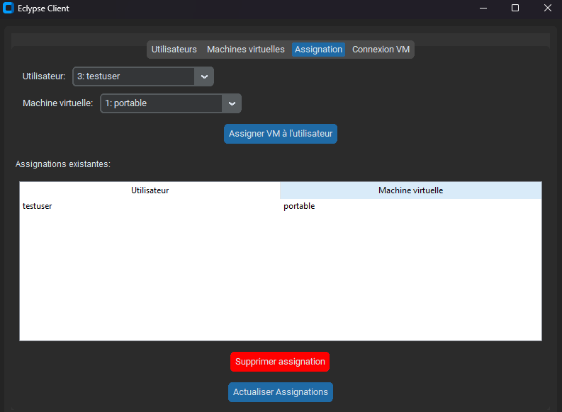

### 1. Register Sunshine Servers
- Use client\add_vm_gui.py or AddVMTool.exe
(Python with customtkinter requests PyJWT urllib3 is required)

- Log in as an admin/master user

- Provide hostname, IP address, and Sunshine credentials

---

### 2. Create User Accounts
- Use client\eclypse.py or EclypseClient.exe
- Sign in as a default admin

- Create User account in user tab

---

### 3. Assign VMs to Users
- Users will only see VMs they're authorized to access

---

### 4. Client Pairing
- Use client\eclypse.py or EclypseClient.exe
- Sign in as a user (without admin privileges)

- Connect to the VM

